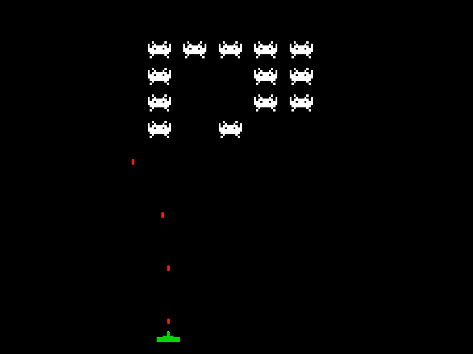

\pagecolor{yellow!30}

The goal of this lab is to provide practical experience
with the HTML5 canvas element.
There is a lot of content in this lab,
you might want to read through it before starting.
The exercises build in complexity, and also involve altering previous exercises.
I suggest you save each exercise as a separate file,
to keep a record of your work.

# Starting

Make a directory, and touch the following files:

- `index.html`
- `style.css`
- `script.js`

Download `sprites.png` from BlackBoard, check the name is correct, and move it to the directory.

### HTML

Start with the following HTML code:

```{.html}
<!DOCTYPE html>
<html lang="en">
  <head>
    <meta charset="UTF-8" />
    <link rel="stylesheet" href="style.css" />
    <script src="script.js" defer></script>
    <title>Game</title>
  </head>
  <body>
    <canvas id="canvas"></canvas>
  </body>
</html>
```

### CSS

You can adjust the styling as you like, but to start, use the following CSS:

```{.css}
* {
  box-sizing: border-box;
}

body {
  display: flex;
  flex-direction: column;
  align-items: center;
  justify-content: center;
  height: 100vh;
  overflow: hidden;
  margin: 0;
}

#canvas{
    background: #dadada;
    display: block;
}
```

This will centre the canvas in the browser window.

### JavaScript

This lab will focus on the JavaScript. Use the code below to get started.

```{.js}
const canvas = document.getElementById("canvas");
const ctx = canvas.getContext("2d");

// set the HTML width and height properties of the canvas
canvas.width = 800;
canvas.height = 600;
// set the style of the canvas too.
canvas.style.backgroundColor = "black";

```

Adjust the values to understand what they affect.

Use `console.log(ctx)` to view the context object, and its properties.

## Exercise 1

The canvas coordinates are 0,0 at the top left, and increase to the right for x and down for y.

Let's draw a square.

We set a global fill style on the context object.
This is the colour of the square, and all other fills will be this colour,
unless we change the fill style again.

The `fillRect(x, y, width, height)` method takes four arguments.
The first two are the coordinates of the top left corner of the square.

```{.js}
ctx.fillStyle = "red";
ctx.fillRect(10, 20, 50, 50);
```

Experiment with the values of `x`, `y`, `width` and `height`.

Draw more than one rectangle, using different fill styles.

## Exercise 2

All other shapes are drawn by manipulating paths.

The `arc(x, y, radius, startAngle, endAngle, anticlockwise)` method can be used to draw circles.

```{.js}
ctx.arc(10, 20, 25, 0, Math.PI * 2);
ctx.fill();
```

Notice the `fill()` method is used to fill the shape.

The `fillStyle` property persists between shapes.

Notice where the circle is drawn.

## Exercise 3

It is useful to create a `class` with a `draw` method,
we can then store attributes in the class, and use them in the draw method.

```{.js}
class Square {
    constructor(x, y, fillStyle) {
        this.x = x;
        this.y = y;
        this.fillStyle = fillStyle;
        this.w = 50;
        this.h = 50;
    }
    draw() {
        ctx.fillStyle = this.fillStyle;
        ctx.fillRect(this.x, this.y, this.w, this.h);
    }
}
```

We can create a number of squares, and draw them, for example:

```{.js}
const squares = [];
const cols = ["red", "green", "blue"];

for (let i = 0; i < 12; i++) {
  squares.push(new Square(i * 50, i * 50, cols[i % 3]));
}

squares.forEach(s => {
  s.draw();
});
```

What does this code do? Experiment with the values of `x`, `y`.

HINT: `Math.random()` will give you a random number between 0 and 1.

## Exercise 4

Add an `update` method and velocity attributes to the `Square` class.

```{.js}
class Square {
    constructor(x, y, fillStyle) {
        // previous code ...
        this.vx = Math.random() * 10 - 5;
        this.vy = Math.random() * 10 - 5;
    }
    draw() {
        // previous code ...
    }
    update() {
        this.x += this.vx;
        this.y += this.vy;
    }
}
```

Nothing changed on the screen yet, but we can now move the squares around.

Create an animation loop, and call the `update` method on each square.

```{.js}
function animate() {
  ctx.clearRect(0, 0, canvas.width, canvas.height);
  squares.forEach(s => {
    s.update();
    s.draw();
  });
  requestAnimationFrame(animate);
}

animate();
```

What happens on the screen?

What happens if we don't call `clearRect`?

## Exercise 5

Write a conditional statement in the update method to detect when the square has gone off the screen.

If it leaves the left or right of the screen, reverse its x velocity.

If it leaves the top or bottom of the screen, reverse its y velocity.

How would the code differ if we draw circles instead of squares?

NOTE: You will probably see squares that get stuck on the edges of the screen. Why is this?

#### Advanced:

Write a function to detect if two squares collide.
This is an example of Axis-Aligned Bounding Box collision detection.

## Exercise 6

Keyboard events can be used to control the movement of the squares.

```{.js}
const KEYS = {};

document.addEventListener("keydown", (event) => {
  KEYS[event.code] = event.type === "keydown";
});

document.addEventListener("keyup", (event) => {
  KEYS[event.code] = event.type === "keydown";
});
```

This code store a truthy value in the `KEYS` object for each key that is pressed.

Change the `update` method to move the squares based on the keys that are pressed.

```{.js}
// prior code...
  update() {
    if (KEYS["ArrowLeft"]) this.x -= 5;
    if (KEYS["ArrowRight"]) this.x += 5;
    if (KEYS["ArrowUp"]) this.y -= 5;
    if (KEYS["ArrowDown"]) this.y += 5;
  }
```

Then modify the `animate` function to work on a single square, for example:

```{.js}
let square = new Square(100, 100, "red");

function animate() {
  ctx.clearRect(0, 0, canvas.width, canvas.height);
  square.update();
  square.draw();
  requestAnimationFrame(animate);
}
// call the animate function
animate();
```

You should see the square move as you press the keys.

## Exercise 7

Read the sprite image and use the `drawImage` method to draw the image.

```{.js}
const sprite = new Image();
sprite.src = "sprites.png";
```

The draw image method is overloaded. We will use the version that takes 9 arguments.

```{.js}
ctx.drawImage(image,
    sourceX, sourceY,
    sourceWidth, sourceHeight,
    destinationX, destinationY,
    destinationWidth, destinationHeight);
```

The source arguments refer to the pixel locations in the image, the destination arguments refer to the pixel locations in the canvas.

We will use the `drawImage` method to draw the sprite - _inside_ our animate function.

```{.js}
function animate() {
  ctx.clearRect(0, 0, canvas.width, canvas.height);
  ctx.drawImage(sprite, 0, 0, 40, 30, 0, 0, 40, 30);
  requestAnimationFrame(animate);
}

animate();
```

You can reference different parts of the image by changing the source arguments.
Change the drawImage arguments to get a different 'frame'.
The next frame starts at 41 pixels from the left, so the sourceX is 41.

```{.js}
// prior code...
  ctx.drawImage(sprite, 41, 0, 40, 30, 0, 0, 40, 30);
// ...
```

## Exercise 8

Now we can consider how to give the appearance of animation by repeatedly swapping the source arguments.

Recall from the lectures, that the callback passed to `requestAnimationFrame` implicitly
receives a time stamp in milliseconds since the loading of the document.
We will use the time stamp to calculate the time since the last frame,
and wait a reasonable amount before switching the image.

The best approach is to develop a class to draw the sprite.

But first, lets look at the idea in isolation.

```{.js}
const sprite = new Image();
sprite.src = "sprites.png";
let prevTime = 0;
let frame = 0;
const frames = [0, 41];

function animate(timestamp) {
    if (timestamp - prevTime > 500) {
        prevTime = timestamp;
        frame = (frame + 1) % frames.length;
      }
  ctx.clearRect(0, 0, canvas.width, canvas.height);
  ctx.drawImage(sprite, frames[frame], 0, 40, 30, 0, 0, 40, 30);
  requestAnimationFrame(animate);
}

animate();
```

There is a lot of code here, let's go through it.
The first two lines are the same as the previous exercise.
Then we create variables to hold the previous time, an index for the frames array, and the frames array itself.

The frames array contains the pixel locations of the image that change.
Other sprites could have many frames, and different x and y offsets. This example
has two frames, so the frames array is [0, 41] which are the two source X pixel values.

In the animate function we check the time since the last frame.
If it is greater than 500 milliseconds,
we update the frame index and reset the previous time.

You can experiment with different values to understand what they do.

## Exercise 9

Write a class to draw the sprite.
The class should have a draw method and an update method that takes a time stamp.

You should include x, y, w, h attributes (see Exercise 3) so you can position the sprite.

Do not create the image inside the class, instead keep it as a global variable.
That way we use just one image, and we can use the same image for all the sprites.

You should be able to use your class like this:

```{.js}
bug = new BugSprite(100, 100);

function animate(timestamp) {
  ctx.clearRect(0, 0, canvas.width, canvas.height);
  bug.update(timestamp);
  bug.draw();
  requestAnimationFrame(animate);
}
```

You should consider combining the code from the update method in Exercises 4, 5 and 6 to create many sprites that move around the canvas.

## Exercise 10

Using what you have learnt so far, make a _"Space Invaders"_ game.
The sprite sheet has other images that you can use.

If you did not work out how to do it earlier, a method to detect collisions is:

```{.js}
function collide(a, b) {
  // AABB collision detection
  if (a.x > b.x + b.w) return false;
  if (a.x + a.w < b.x) return false;
  if (a.y > b.y + b.h) return false;
  if (a.y + a.h < b.y) return false;
  return true;
}
```



This is a very challenging exercise - you are not expected to complete it in a single lab session.
You should build up to it by fully understanding what we have done so far.
