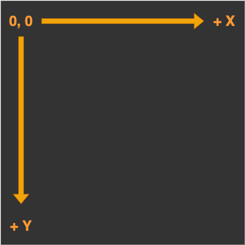
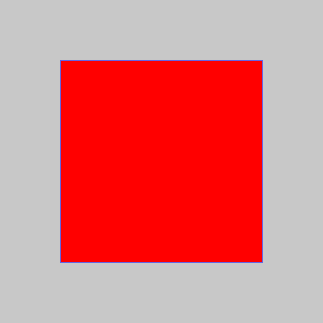
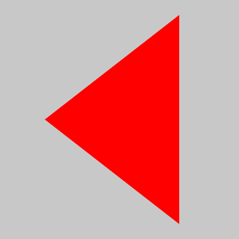
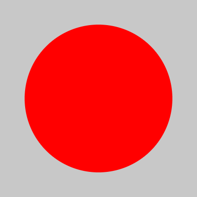
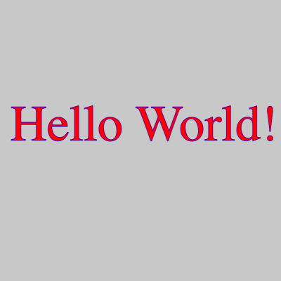
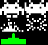
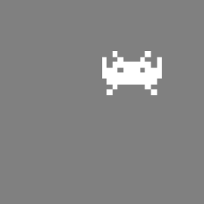
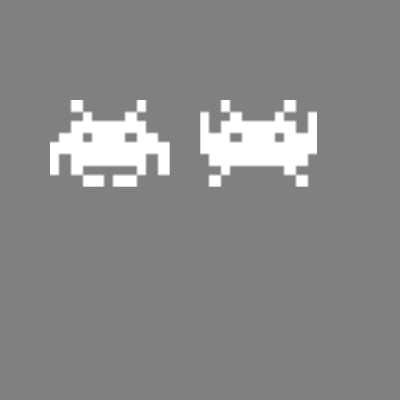
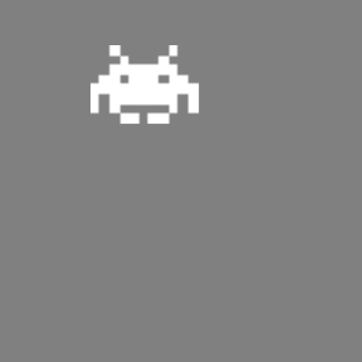
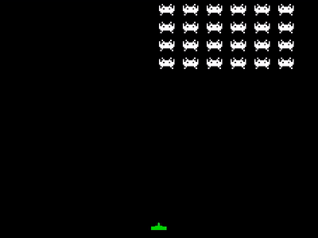

# Contents

::: incremental

- The `canvas` element
- The rendering _context_
- Drawing shapes
- Sprites
- Animation with `requestAnimationFrame`
- Responding to events

:::

## Documentation

- [W3Schools](https://www.w3schools.com/tags/ref_canvas.asp)
- [Mozilla](https://developer.mozilla.org/en-US/docs/Web/HTML/Element/canvas)
- [Canvas API](https://developer.mozilla.org/en-US/docs/Web/API/Canvas_API)

::: notes
It is best to refer to canonical documentation for the Canvas API.
Here are some links to recommended documentation.
:::

## Further reading

Eloquent JavaScript has a chapter on the canvas element.

- [https://eloquentjavascript.net](https://eloquentjavascript.net)

#

::: r-fit-text
`<canvas>`
:::

::: notes
This is where it starts - the canvas DOM element.
:::

## Canvas element {data-auto-animate="true"}

A canvas is a single DOM element that contains a image.

- Does not preserve shapes such that they can be moved or resized.
- The only way to move a shape is to _clear_ the canvas and _redraw_ it.

## Canvas element {data-auto-animate="true"}

```{.html}
<canvas width="150" height="150"></canvas>
```

- Two optional attributes: width and height.
- Can be set using DOM properties.
- Default values are 300 wide 150 high.

::: notes
Later, we will be able to access this particular canvas with getElementByID.
:::

## Canvas element {data-auto-animate="true"}

- A new canvas is transparent and shows as an empty space in the document.
- The element can be sized by CSS, but during rendering is scaled to fit its layout size.
- If the CSS sizing doesn't respect the ratio of the initial canvas, it will appear distorted.

::: notes
This behaviour is similar to an image.
TIP: if you want to save the canvas as an image - you might want to fill it with a solid colour.
(fillRect()).
:::

## Canvas element {data-auto-animate="true"}

```{.html}
<canvas width="150" height="150">
  display this text if the browser
  does not support HTML5 canvas
</canvas>
```

- Fallback content is placed between the open and closing tags.
- The closing tag is **required**
  - ...else all subsequent content is ignored.

## Canvas element {data-auto-animate="true"}

```{.html data-line-numbers="|10" }
<!DOCTYPE html>
<html lang="en">
<head>
    <meta charset="UTF-8">
    <link rel="stylesheet" href="style.css">
    <script src="script.js" defer></script>
    <title>HTML Canvas</title>
</head>
<body>
    <canvas id="canvas"></canvas>
</body>
</html>
```

::: notes
Here is a simple HTML document with a canvas element.
The `<canvas>` element goes in the body of the document.
The `id` attribute is a global HTML attribute.
We did not set a width and height attribute.
:::

# Canvas API

The Canvas _API_ provides a means for drawing graphics using
JavaScript and the `<canvas>` DOM element.

::: notes
The canvas element is arguably the single most powerful HTML5 element,
although its real power lies in the Canvas context,
which you obtain from the canvas element itself.
:::

## Canvas API

We can use the canvas for:

::: incremental

- animation
- game graphics
- data visualization
- image manipulation
- real-time video

:::

## The rendering context {data-auto-animate="true"}

The `<canvas>` element creates a fixed-size drawing surface that exposes a rendering _context_.

::: notes
The notion of a context is quite common in programming. If you take a graphics course, you will likely encounter the openGL context, for example.
:::

## The rendering context {data-auto-animate="true"}

We will use the `2d` rendering context.

## The rendering context {data-auto-animate="true"}

There is also a 3D rendering context: **WebGL**

This has many powerful features, including access to the graphics hardware, and openGL like shaders.

We will not cover the 3D context in this lecture.

::: notes
Other contexts provide different types of rendering;
for example, WebGL uses a 3D context similar to OpenGL.
:::

## The rendering context {data-auto-animate="true"}

```{.js }
const canvas = document.getElementById("canvas");
const ctx = canvas.getContext("2d");
```

You create a context with the getContext method on the `<canvas>` DOM element.

## The rendering context {data-auto-animate="true"}

Access the Canvas API via the `ctx` object.

You should inspect the context object in the console.

```{.js }
console.log(ctx)
```

::: notes
I strongly encourage you to do this, you will see all the methods available.
:::

## The rendering context {data-auto-animate="true"}

```{.js }
console.log(ctx)
```

You will see current values for all the attributes, and if you expand the
`CanvasRenderingContext2D` field you will see the many methods available.

# Drawing

## Drawing {data-auto-animate="true"}

::: columns

::::: {.column width=40%}



:::::

::::: column

The rendering context has a coordinate system
which, by default, places the _origin_ at the
top left corner of the canvas.

Each unit of length is 1 pixel.

:::::

:::

::: notes
NB. This is by default. It is possible to transform the coordinate system.
Width extends in the x, height extends in the y directions.
:::

## Drawing {data-auto-animate="true"}

Canvas supports two primitive shapes: rectangles and paths.

A shape can be _filled_, meaning its area is given a certain colour or pattern,
or it can be _stroked_, which means a line is drawn along its edge.

## Drawing {data-auto-animate="true"}

There are three functions that draw rectangles on the canvas:

```{.js }
 fillRect(x, y, width, height)
 strokeRect(x, y, width, height)
 clearRect(x, y, width, height)
```

## Drawing {data-auto-animate="true"}

```{.js }
 fillRect(x, y, width, height)
 strokeRect(x, y, width, height)
 clearRect(x, y, width, height)
```

The parameters are the same for all three functions:

- `x, y` define the top left corner
- then we have width and height

::: notes
(x, y) are the coordinates of the top left corner of the rectangle.
Draws a filled rectangle.
Draws a rectangular outline.
Clears the specified rectangular area, making it fully transparent.
:::

## Drawing {data-auto-animate="true"}

The colour of the fill, thickness of the stroke, and so on,
are not determined by an argument to the drawing method,
but by properties of the context object.

::: notes
IMPORTANT
:::

## Drawing {data-auto-animate="true"}

```{.js }
ctx.fillStyle = "red";
```

- `fillStyle` defines the fill appearance.
- Set to a string that specifies a colour.
- Uses the same colour notation as CSS.

## Drawing {data-auto-animate="true"}

```{.js }
ctx.strokeStyle = "blue";
ctx.lineWidth = 5;
```

- `strokeStyle` specifies the colour of a stroked line.
- Width is set by the `lineWidth` property.
- `lineWidth` may be any positive number.

## Drawing {data-auto-animate="true"}

::: columns
:::: column

::::
:::: {.column width=55%}

```{.js }
const x = y = 75
const w = h = 250
ctx.fillStyle = "red"
ctx.strokeStyle = "blue"
ctx.fillRect(x, y, w, h)
ctx.strokeRect(x, y, w, h)
```

::::
:::

## Paths {data-auto-animate="true"}

A path is a sequence of points, connected by segments of lines that can
be of different shapes, of different width and of different colour.

## Paths {data-auto-animate="true"}

It is possible to build any complex shape using a
combination of the path tools.

## Paths {data-auto-animate="true"}

::: incremental

- Paths are not values that can be stored and passed around.
- You must make a sequence of method calls to describe its shape.

:::

## Paths {data-auto-animate="true"}

::: incremental

- Each segment created with `lineTo` starts at the path’s current position.
- The current position is usually the end of the last segment.
- Or, it is the position passed to `moveTo`.

:::

## Paths {data-auto-animate="true"}

When filling a path:

- Each shape is filled separately.
- A path can have multiple shapes.
- The path needs to be closed.

## Paths {data-auto-animate="true"}

If the path is not already closed, a line is added from its end to its start.

The shape _enclosed_ by the now completed path is filled.

## Paths {data-auto-animate="true"}

::: columns
:::: column

::::
:::: {.column width=55%}

```{.js }
ctx.fillStyle = "red"
ctx.beginPath()
ctx.moveTo(75, 200)
ctx.lineTo(300, 375)
ctx.lineTo(300, 25)
ctx.fill()
```

::::
:::

::: notes
Our triangle example uses the implicit completion of the path.
:::

## Curves {data-auto-animate="true"}

A path may also contain curved lines.

- These are a bit more involved to draw.

## Curves {data-auto-animate="true"}

Complex curves and shapes can be drawn using _Bezier_ and _quadratic_ curves.
We wont cover these functions for now.

- `quadraticCurveTo()`
- `bezierCurveTo()`

::: fragment
But you should know that they are available.
:::

## Curves {data-auto-animate="true"}

To draw circle segments we use the arc functions.

- `arc(x, y, radius, startAngle, endAngle, counterclockwise)`
- `arcTo(x1, y1, x2, y2, radius)`

::: notes
arc() ... Draws an arc which is centred at (x, y) position with radius r starting at
startAngle and ending at endAngle
going in the given direction
indicated by counter clockwise (defaulting to clockwise).

arcTo() ... Draws an arc with the given control points and radius,
connected to the previous point by a straight line.
:::

## Curves {data-auto-animate="true"}

::: columns
:::: column

::::
:::: {.column width=55%}

```{.js }
ctx.fillStyle = "red"
ctx.arc(200, 200, 150, 0, Math.PI * 2)
ctx.fill()
```

::::
:::

## Text {data-auto-animate="true"}

The canvas rendering context provides two methods to render text:

- `fillText(text, x, y [, maxWidth])`
- `strokeText(text, x, y [, maxWidth])`

::: notes
Fills a given text at the given (x,y) position.
Optionally with a maximum width to draw.

Strokes a given text at the given (x,y) position.
Optionally with a maximum width to draw.
:::

## Text {data-auto-animate="true"}

::: columns
:::: column

::::
:::: {.column width=55%}

```{.js }
const text = "Hello World!"
const x = 15, y = 200
ctx.fillStyle = "red"
ctx.strokeStyle = "blue"
ctx.font = '72px serif'
ctx.fillText(text, x, y)
ctx.strokeText(text, x, y)
```

::::
:::

# Sprites

## Bitmap graphics {data-auto-animate="true"}

Images for computer graphics are usually in one of two categories:

- Vector graphics
- Bitmap graphics

So far we have been working with vector graphics - where we have specified
shapes with lines and curves.

## Bitmap graphics {data-auto-animate="true"}

Bitmap graphics don’t specify shapes but work with **pixel** data.

Pixel data defines values on a regular 2D grid.

::: notes
Sometimes called raster graphics.
:::

## Bitmap graphics {data-auto-animate="true"}

The `drawImage()` method allows us to draw pixel data onto a canvas.

This pixel data can originate from an  element or from another canvas.

```{.js }
let img = document.createElement("img")
img.src = "img.png"
```

## Bitmap graphics {data-auto-animate="true"}

However, if we just call `drawImage()`, it is unlikely to display the image as we expect.

```{.js }
let img = document.createElement("img")
img.src = "img.png"
ctx.drawImage(img, 0, 0)
```

Why is this?

## Bitmap graphics {data-auto-animate="true"}

It is **essential** to ensure the image resource is loaded _before_ drawing.

## Bitmap graphics {data-auto-animate="true"}

```{.js }
const canvas = document.getElementById("canvas")
const ctx = canvas.getContext("2d")

let img = document.createElement("img")
img.src = "img.png"

img.addEventListener("load", () => {
  ctx.drawImage(img, 0, 0)
});
```

::: notes
This example creates a detached  element and loads an image file into it.
But it cannot immediately start drawing from this picture because the browser
may not have loaded it yet. To deal with this, we register a "load" event
handler and do the drawing after the image has loaded.
:::

## Bitmap graphics {data-auto-animate="true"}

In addition to the previous example, the `drawImage()` method can take two further arguments:

- `drawImage(image, dx, dy, dWidth, dHeight)`
- this lets us scale the image.

::: notes
In the example on the previous slide, we used the `drawImage(image, dx, dy)` method to draw our image at the origin of the canvas.
:::

## Bitmap graphics {data-auto-animate="true"}

The `drawImage()` method also has a _nine_ argument version which lets us specify the source rectangle:

- `drawImage(image, sx, sy, sWidth, sHeight, dx, dy, dWidth, dHeight)`
- `s*` define the source rectangle.
- `d*` define the destination rectangle.

::: notes
This means we can trim out a section if the source image, then place it on the canvas, at any scale.
:::

## Sprites {data-auto-animate="true"}

Sprites are two-dimensional images included in a larger scene.

::: incremental

- Often used for animation.
- Multiple poses can be stored in one image...
- a **sprite sheet**

:::

## Sprites {data-auto-animate="true"}

::: columns
:::: column
{width=80%}
::::
:::: column
Storing all the image frames in a single file is often preferred for compression efficiency.
::::
:::

::: notes
For example, png supports transparency in the alpha channel,
and run length encoding is used to reduce the size of the image.
:::

## Sprites {data-auto-animate="true"}

::: columns
:::: column
{width=80%}
::::
:::: column
{width=80%}
::::
:::

The ability to select a source rectangle allows us to render a section of the entire sheet.

## Sprites {data-auto-animate="true"}

::: columns
:::: column


::::
:::: {.column width=55%}

- Source rectangle is `41,0,40,29`
- Destination is `200,100,120,87`
- We have "cut out" a region of the sprite sheet and placed it on the canvas.
- The canvas respects the alpha value of the source image.

::::
:::

## Sprites {data-auto-animate="true"}

consider this source code:

```{.js }
const sw = 40, sh = 29
const dw = 120, dh = 87

sprite.addEventListener('load', () => {
  ctx.drawImage(sprite, 0, 0, sw, sh, 50, 100, dw, dh)
  ctx.drawImage(sprite, 41, 0, sw, sh, 200, 100, dw, dh)
})
```

what does this code do?

## Sprites {data-auto-animate="true"}

::: columns
:::: column



::::
:::: {.column width=55%}

We have cut out **two** regions of the sprite sheet and placed them on the canvas.

::::
:::

## Sprites {data-auto-animate="true"}

Here is the Idea...

Draw one image, then draw another image _in the same place_.

# Animation {background-image="assets/horse.gif"}

## Animation {data-auto-animate="true"}

`requestAnimationFrame()`

::: incremental

- Tells the browser that you wish to perform an animation.
- Requests that the browser calls a **callback** function.
- The callback _updates_ an animation before the next **repaint**.

:::

::: notes
Formerly, to create an animation in JavaScript, we relied on setTimeout() called recursively or setInterval() to repeatedly execute some code to make changes to an element frame by frame, such as once every 50 milliseconds
:::

## Animation {data-auto-animate="true"}

`requestAnimationFrame()`

A **callback** is a function passed as an argument to another function.

::: incremental

- The callback function is always passed a _timestamp_.
- The timestamp gives the _milliseconds_ since the page was loaded.

:::

::: notes
The timestamp value therefore increases while the page remains loaded.
:::

## Using a callback function {data-auto-animate="true"}

You will write the callback function:

```{.js }
function myCallBack(timestamp) {
  console.log(timestamp)
}

requestAnimationFrame(myCallBack)
```

## Using a callback function {data-auto-animate="true"}

You will notice that we get only one value printed to console.

::: incremental

- We need to call `requestAnimationFrame()` again to get the next value.
- and again...
- and again...

:::

::: notes
and again, and again...
:::

## Recursion {data-auto-animate="true"}

We do this using **recursion**

```{.js data-line-numbers="1-6|3"}
function myCallBack(timestamp) {
  console.log(timestamp)
  requestAnimationFrame(myCallBack)
}

myCallBack()
```

::: {.fragment}

- we moved `requestAnimationFrame()` into our callback

:::

::: notes
Recursion is a technique that allows a function to call itself.
It is a tricky subject to understand, so for now I will just give example code.
:::

## Recursion {data-auto-animate="true"}

We make a call to our function, to start the recursion.

```{.js data-line-numbers="6"}
function myCallBack(timestamp) {
  console.log(timestamp)
  requestAnimationFrame(myCallBack)
}

myCallBack()
```

## Recursion {data-auto-animate="true"}

How often does the callback function get called?

```
1396.32
1412.986
1429.652
1446.318
1462.984
1479.65
1496.316
```

::: notes
Around 16 or 17 ms?
:::

## Using a callback function {data-auto-animate="true"}

Often we want to do something after a period of time has passed.

- Store the previous time globally and compare it to the current time.
- Check if the enough time has passed in our callback.

## Using a callback function {data-auto-animate="true"}

```{.js data-line-numbers="1-11|1|4-6|8|11"}
let prevTime = 0

function myCallBack(timestamp) {
  if (timestamp - prevTime > 500) {
    prevTime = timestamp
    console.log(timestamp)
  }
  requestAnimationFrame(myCallBack)
}

myCallBack()
```

## Using a callback function {data-auto-animate="true"}

Now we get this sort of output:

```
514.689
1031.335
1547.981
2064.627
2581.273
3097.919
3598.031
```

::: notes
Why is it not 500, 1000, 1500, etc?
:::

## Animation {data-auto-animate="true"}

Instead of logging to console, we could draw our image on the canvas.

## Animation {data-auto-animate="true"}

Store some global variables.

```{.js }
let prevTime = 0
let frame = 0
```

## Animation {data-auto-animate="true"}

Write a draw function.

```{.js data-line-numbers="1-6|4|5"}
function draw(frame, x, y) {
  let sx = 41
  if (frame === 0) sx = 0
  ctx.clearRect(0, 0, canvas.width, canvas.height)
  ctx.drawImage(sprite, sx, 0, 40, 29, x, y, 120, 87)
}
```

::: notes
We need to clear the canvas before the next paint.
:::

## Animation {data-auto-animate="true"}

Finally, we call our animate function.

```{.js data-line-numbers="1-10|4|6|10"}
function animate(timestamp) {
  if (timestamp - prevTime > 500) {
    prevTime = timestamp
    frame = (frame + 1) % 2
  }
  draw(frame, 100, 50)
  requestAnimationFrame(animate)
}

animate()
```

::: notes
We changed the callback name to something more descriptive.
:::

## Animation {data-auto-animate="true"}

::: columns
:::: column



::::
:::: {.column width=55%}

We now have our sprite's frames drawn alternately.

::::
:::

# Events {data-auto-animate="true"}

Formally, an event is a message sent from the browser to a JavaScript function, for example:

- mouse clicks
- key presses
- window resizes

## Events {data-auto-animate="true"}

Informally, we can describe events in our animation that require some sort of response, such as collision detection in a game.

## Keyboard Events {data-auto-animate="true"}

```{.js data-line-numbers="1-9|1|3-5|7-9"}
const KEYS = {}

document.addEventListener("keydown", (event) => {
    KEYS[event.code] = event.type === "keydown"
})

document.addEventListener("keyup", (event) => {
    KEYS[event.code] = event.type === "keydown"
})
```

::: notes
We store keys pressed in a global constant object.
Then, an event listener is attached to the document,
using an arrow function.
As keys are pressed, the corresponding element in the object is set to true.
:::

## Keyboard Events {data-auto-animate="true"}

To check if a key is pressed, we can read the `KEYS` object.

```{.js }
if (KEYS['ArrowLeft']) x -= 1
if (KEYS['ArrowRight']) x += 1
```

::: notes
This should provide a clue as to how to move an object around...
:::

## Collision Detection {data-auto-animate="true"}

Often we want to know if two objects are touching, or overlapping.

- game characters
- frame boundaries
- UI elements

::: notes
collision detection is certainly a big topic - but we need to make a start here.
:::

## AABB Collision Detection {data-auto-animate="true"}

What is an Axis Aligned Bounding Box (AABB)?

::: notes
The first type of collision we will look at is AABB. In 2D...
:::

## AABB Collision Detection {data-auto-animate="true"}

An AABB is the smallest rectangle that encloses an object and is _aligned_ with the _axes_ of the coordinate system.

::: incremental

- the left and right edges of the AABB are parallel to the x-axis
- the top and bottom edges of the AABB are parallel to the y-axis

:::

## AABB Collision Detection {data-auto-animate="true"}

compare two objects with x, y, width and height properties

```{.js }
function AABB(a, b) {
  if (a.x > b.x + b.w) return false
  if (a.x + a.w < b.x) return false
  if (a.y > b.y + b.h) return false
  if (a.y + a.h < b.y) return false
  return true
}
```

::: notes
What does this function do?
you will have to design your own object to use this function.
:::

## AABB Collision Detection {data-auto-animate="true"}

You could consider a variation of this method to check if an object is within the bounds of the canvas.

## Radial Collision Detection {data-auto-animate="true"}

Radial collision detection uses Pythagoras' theorem to determine if two objects are touching.

If the squared sum of the radii is greater than the squared distance between the centres, then the objects are colliding.

## Radial Collision Detection {data-auto-animate="true"}

compare two objects with x, y and radius properties

```{.js }
function radial(a, b) {
  let radii = a.radius + b.radius
  let dx = a.x - b.x
  let dy = a.y - b.y
  return radii * radii > dx * dx + dy * dy
}
```

## Collision Detection {data-auto-animate="true"}

Once we have detected a collision, we can respond...

::: notes
I wont go into physics and so on...
:::

# Summary

::: incremental

- The `canvas` element
- Drawing shapes
- Sprites
- Animation with `requestAnimationFrame`
- Events
- Collisions

:::

::: notes
We've covered a lot of material...
:::

#

See you in the labs!

{ width=80%}
