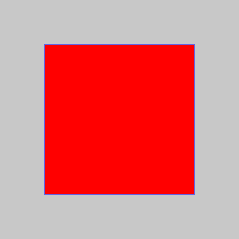
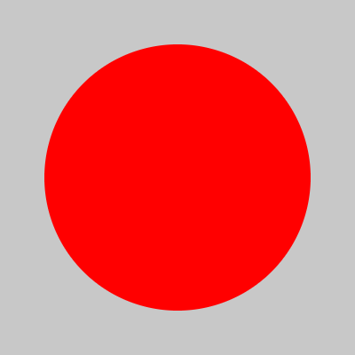
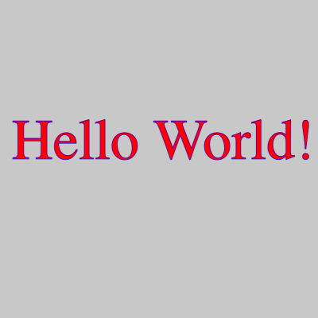
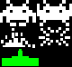

# Dr. David Greenwood

david.greenwood@uea.ac.uk

SCI 2.16a

# Contents

::: incremental

- The `canvas` element
- The rendering _context_
- Drawing shapes
- Animation with `requestAnimationFrame`
- Sprites
- Responding to events

:::

## Documentation

- [W3Schools](https://www.w3schools.com/tags/ref_canvas.asp)
- [Mozilla](https://developer.mozilla.org/en-US/docs/Web/HTML/Element/canvas)
- [Canvas API](https://developer.mozilla.org/en-US/docs/Web/API/Canvas_API)

::: notes
It is best to refer to canonical documentation for the Canvas API.
Here are some links to recommended documentation.
:::

## Canvas HTML element {data-auto-animate="true"}

`<canvas id="mycanvas" width="150" height="150"></canvas>`

- The `<canvas>` element has two attributes, width and height.
- Both are optional and can be set using DOM properties.
- Default values are 300 pixels wide and 150 pixels high.
- The `id` attribute is a global HTML attribute.

## Canvas HTML element {data-auto-animate="true"}

- The element can be sized by CSS, but during rendering is scaled to fit its layout size.
- If the CSS sizing doesn't respect the ratio of the initial canvas, it will appear distorted.

## Canvas HTML element {data-auto-animate="true"}

```{.html}
<canvas id="mycanvas" width="150" height="150">
  display this text if the browser
  does not support HTML5 canvas
</canvas>
```

- Fallback content is placed between the open and closing tags.
- The closing tag is _required_, else all subsequent content is ignored.

## Canvas HTML element {data-auto-animate="true"}

```{.html data-line-numbers="|9" }
<!DOCTYPE html>
<html lang="en">
<head>
    <meta charset="UTF-8">
    <link rel="stylesheet" href="style.css">
    <title>Canvas</title>
</head>
<body>
    <canvas id="canvas"></canvas>
    <script src="script.js"></script>
</body>
</html>
```

::: notes
The HTML is simple and concise.
The `<canvas>` element is the only element that is
required beyond the standard boiler plate.
:::

# Canvas API

The Canvas _API_ provides a means for drawing graphics using JavaScript and the HTML `<canvas>` element.

::: notes
The canvas element is arguably the single most powerful HTML5 element,
although its real power lies in the Canvas context,
which you obtain from the canvas element itself.
:::

## Canvas API

We can use the canvas for:

::: incremental

- animation
- game graphics
- data visualization
- image manipulation
- real-time video

:::

## The rendering context {data-auto-animate="true"}

The `<canvas>` element creates a fixed-size drawing surface that exposes a rendering _context_.

## The rendering context {data-auto-animate="true"}

We will use the 2D rendering context.

::: notes
Other contexts provide different types of rendering;
for example, WebGL uses a 3D context based on OpenGL.
:::

## The rendering context {data-auto-animate="true"}

```{.js }
const canvas = document.getElementById("canvas");
const ctx = canvas.getContext("2d");
```

## The rendering context {data-auto-animate="true"}

Access the Canvas API via the `ctx` object.

You can inspect the context object in the console.

```{.js }
console.log(ctx);
```

## Drawing {data-auto-animate="true"}

The rendering context has a coordinate system
which, by default, places the _origin_ at the
top left corner of the canvas.

Each unit of length is 1 pixel.

::: notes
NB. This is by default. It is possible to transform the coordinate system.
:::

## Drawing {data-auto-animate="true"}

Canvas supports two primitive shapes: rectangles and paths.

There are three functions that draw rectangles on the canvas:

- `fillRect(x, y, width, height)`
- `strokeRect(x, y, width, height)`
- `clearRect(x, y, width, height)`

::: notes
(x, y) are the coordinates of the top left corner of the rectangle.
Draws a filled rectangle.
Draws a rectangular outline.
Clears the specified rectangular area, making it fully transparent.
:::

## Drawing {data-auto-animate="true"}

::: columns
:::: column

::::
:::: {.column width=55%}

```{.js }
const x = y = 75,
      w = h = 250;
ctx.fillStyle = "red";
ctx.strokeStyle = "blue";
ctx.fillRect(x, y, w, h);
ctx.strokeRect(x, y, w, h);
```

::::
:::

## Drawing {data-auto-animate="true"}

A path is a list of points, connected by segments of lines that can
be of different shapes, of different width and of different color.

## Drawing {data-auto-animate="true"}

It is possible to build any complex shape using a
combination of the path tools.

## Drawing {data-auto-animate="true"}

::: columns
:::: column

::::
:::: {.column width=55%}

```{.js }
ctx.fillStyle = "red";
ctx.beginPath();
ctx.moveTo(75, 200);
ctx.lineTo(300, 375);
ctx.lineTo(300, 25);
ctx.fill();
```

::::
:::

## Drawing {data-auto-animate="true"}

To draw curved lines we use the arc functions.

- `arc(x, y, radius, startAngle, endAngle, counterclockwise)`
- `arcTo(x1, y1, x2, y2, radius)`

::: notes
Draws an arc which is centred at (x, y) position with radius r starting at
startAngle and ending at endAngle
going in the given direction
indicated by counterclockwise (defaulting to clockwise).

Draws an arc with the given control points and radius,
connected to the previous point by a straight line.
:::

## Drawing {data-auto-animate="true"}

::: columns
:::: column

::::
:::: {.column width=55%}

```{.js }
ctx.fillStyle = "red";
ctx.arc(200, 200, 150, 0,
  Math.PI * 2);
ctx.fill();
```

::::
:::

## Drawing {data-auto-animate="true"}

The canvas rendering context provides two methods to render _text_:

- `fillText(text, x, y [, maxWidth])`
- `strokeText(text, x, y [, maxWidth])`

::: notes
Fills a given text at the given (x,y) position.
Optionally with a maximum width to draw.

Strokes a given text at the given (x,y) position.
Optionally with a maximum width to draw.
:::

## Drawing {data-auto-animate="true"}

::: columns
:::: column

::::
:::: {.column width=55%}

```{.js }
const text = "Hello World!";
const x = 15, y = 200;
ctx.fillStyle = "red";
ctx.strokeStyle = "blue";
ctx.font = '72px serif';
ctx.fillText(text, x, y);
ctx.strokeText(text, x, y);
```

::::
:::

## Drawing {data-auto-animate="true"}

There are many more functions available for drawing.

Consult the documentation, and see the examples
[here](https://developer.mozilla.org/en-US/docs/Web/API/Canvas_API/Tutorial) for a complete list.

# Animation {background-image="assets/horse.gif"}

Creating the impression of motion!

## Animation {data-auto-animate="true"}

`requestAnimationFrame()`

This method tells the browser that you wish to perform an animation
and requests that the browser calls a callback function to update
an animation before the next repaint.

## Animation {data-auto-animate="true"}

`requestAnimationFrame()`

The callback function is passed a _timestamp_.

The timestamp is the number of milliseconds since the page was loaded.

# Sprites

More complex graphics.

## Sprites {data-auto-animate="true"}

::: columns
:::: column
{ width=80%}
::::
:::: column
Storing all the image frames in a single file is often preferred for compression efficiency.
::::
:::

# Events

Formally, an event is a message that is sent from the browser to a JavaScript function. Examples of events are: mouse clicks, key presses, and window resizes.

Informally, we can include events in our animation that require some sort of response such as collision detection in a game.

## Keyboard Events {data-auto-animate="true"}

```{.js data-line-numbers="1-9|1|3-5|7-9"}
const KEYS = {};

document.addEventListener("keydown", (event) => {
    KEYS[event.code] = event.type === "keydown";
});

document.addEventListener("keyup", (event) => {
    KEYS[event.code] = event.type === "keydown";
});
```

::: notes
We store keys pressed in a global constant object.
Then, an event listener is attached to the document,
using an arrow function.
As keys are pressed, the corresponding element in the object is set to true.
:::

#

<video loop data-autoplay data-src="assets/invaders.mp4"></video>

Questions?
